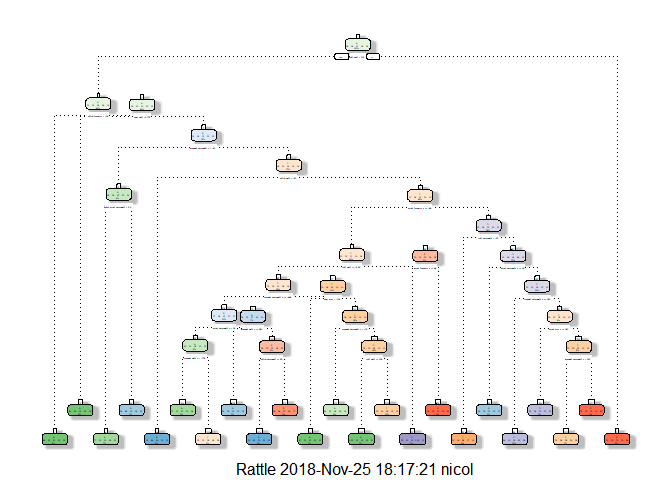

# Practical Machine Learning - Prediction Assignment #

### Introduction ###
Using devices such as Jawbone Up, Nike FuelBand, and Fitbit it is now possible to collect a large amount of data about personal activity relatively inexpensively. These types of devices are part of the quantified self movement - a group of enthusiasts who take measurements about themselves regularly to improve their health, to find patterns in their behavior, or because they are tech geeks. One thing that people regularly do is quantify how much of a particular activity they do, but they rarely quantify how well they do it. In this project, we will use data from accelerometers on the belt, forearm, arm, and dumbbell of 6 participants. They were asked to perform barbell lifts correctly and incorrectly in 5 different ways. 

### Downloading the Data and Loading R Packages ###
The data for this project comes from the following source:
  http://web.archive.org/web/20161224072740/http:groupware.les.inf.puc.rio/br/har. We need to first load the packages we will be using in this project and download the data into dataframes. 


```r
library(caret)
```

```
## Loading required package: lattice
```

```
## Loading required package: ggplot2
```

```r
library(rpart)
library(rpart.plot)
library(RColorBrewer)
library(rattle)
```

```
## Rattle: A free graphical interface for data science with R.
## Version 5.2.0 Copyright (c) 2006-2018 Togaware Pty Ltd.
## Type 'rattle()' to shake, rattle, and roll your data.
```

```r
library(randomForest)
```

```
## randomForest 4.6-14
```

```
## Type rfNews() to see new features/changes/bug fixes.
```

```
## 
## Attaching package: 'randomForest'
```

```
## The following object is masked from 'package:rattle':
## 
##     importance
```

```
## The following object is masked from 'package:Biobase':
## 
##     combine
```

```
## The following object is masked from 'package:BiocGenerics':
## 
##     combine
```

```
## The following object is masked from 'package:ggplot2':
## 
##     margin
```

```r
download.file(url="http://d396qusza40orc.cloudfront.net/predmachlearn/pml-training.csv",
              destfile="pml-training.csv",method="curl")

dt_training<- read.csv("pml-training.csv",
                       na.strings=c("NA","#DIV/0!",""))

download.file(url="http://d396qusza40orc.cloudfront.net/predmachlearn/pml-testing.csv",
              destfile="pml-testing.csv",method="curl")

dt_testing<- read.csv("pml-testing.csv",
                      na.strings=c("NA","#DIV/0!",""))
```

### Cleaning the Data ###
Next we will remove columns with NA values as well as features that are not in the testing set. We also remove the first 7 features, as they are related to the time-series and are not needed in this analysis. 

```r
features<- names(dt_testing[,colSums(is.na(dt_testing))==0])[8:59]

dt_training <- dt_training[,c(features,"classe")]
dt_testing <- dt_testing[,c(features,"problem_id")]

dim(dt_training);dim(dt_testing)
```

```
## [1] 19622    53
```

```
## [1] 20 53
```

### Partitioning Data ###
Next, we will partition the data into a training (60% of the data) and testing set (the remaining 40% of the data).

```r
set.seed(12345)

inTrain <- createDataPartition(dt_training$classe,
                               p=0.6,list=FALSE)
training<- dt_training[inTrain,]
testing<- dt_training[-inTrain,]
dim(training);dim(testing)
```

```
## [1] 11776    53
```

```
## [1] 7846   53
```

### Decision Tree Modeling ###
Next, we will use Decision Tree Modeling as a prediction.


```r
modFitDT<- rpart(classe~ .,data=training,
                 method="class")
fancyRpartPlot(modFitDT)
```

<!-- -->

```r
set.seed(12345)

prediction<- predict(modFitDT, testing, type="class")
confusionMatrix(prediction, testing$classe)
```

```
## Confusion Matrix and Statistics
## 
##           Reference
## Prediction    A    B    C    D    E
##          A 1879  260   30   69   66
##          B   56  759   88   34   54
##          C  105  340 1226  354  234
##          D  155  132   23  807   57
##          E   37   27    1   22 1031
## 
## Overall Statistics
##                                           
##                Accuracy : 0.7267          
##                  95% CI : (0.7167, 0.7366)
##     No Information Rate : 0.2845          
##     P-Value [Acc > NIR] : < 2.2e-16       
##                                           
##                   Kappa : 0.6546          
##  Mcnemar's Test P-Value : < 2.2e-16       
## 
## Statistics by Class:
## 
##                      Class: A Class: B Class: C Class: D Class: E
## Sensitivity            0.8418  0.50000   0.8962   0.6275   0.7150
## Specificity            0.9243  0.96334   0.8405   0.9441   0.9864
## Pos Pred Value         0.8155  0.76589   0.5427   0.6874   0.9222
## Neg Pred Value         0.9363  0.88928   0.9746   0.9282   0.9389
## Prevalence             0.2845  0.19347   0.1744   0.1639   0.1838
## Detection Rate         0.2395  0.09674   0.1563   0.1029   0.1314
## Detection Prevalence   0.2937  0.12631   0.2879   0.1496   0.1425
## Balanced Accuracy      0.8831  0.73167   0.8684   0.7858   0.8507
```

### Random Forest Model ###
Next, we will use Random Forest Modeling as a prediction. 

```r
set.seed(12345)
modFitRF <- randomForest(classe ~ ., data=training,
                         ntree=1000)

prediction<- predict(modFitRF, testing, type="class")
confusionMatrix(prediction, testing$classe)
```

```
## Confusion Matrix and Statistics
## 
##           Reference
## Prediction    A    B    C    D    E
##          A 2230    9    0    0    0
##          B    2 1505    7    0    0
##          C    0    4 1361   16    2
##          D    0    0    0 1268    4
##          E    0    0    0    2 1436
## 
## Overall Statistics
##                                           
##                Accuracy : 0.9941          
##                  95% CI : (0.9922, 0.9957)
##     No Information Rate : 0.2845          
##     P-Value [Acc > NIR] : < 2.2e-16       
##                                           
##                   Kappa : 0.9926          
##  Mcnemar's Test P-Value : NA              
## 
## Statistics by Class:
## 
##                      Class: A Class: B Class: C Class: D Class: E
## Sensitivity            0.9991   0.9914   0.9949   0.9860   0.9958
## Specificity            0.9984   0.9986   0.9966   0.9994   0.9997
## Pos Pred Value         0.9960   0.9941   0.9841   0.9969   0.9986
## Neg Pred Value         0.9996   0.9979   0.9989   0.9973   0.9991
## Prevalence             0.2845   0.1935   0.1744   0.1639   0.1838
## Detection Rate         0.2842   0.1918   0.1735   0.1616   0.1830
## Detection Prevalence   0.2854   0.1930   0.1763   0.1621   0.1833
## Balanced Accuracy      0.9988   0.9950   0.9957   0.9927   0.9978
```

### Using the prediction modeling on testing data ###
First, we will use the Decision Tree modeling as a predictor on the testing data, followed by using the Random Forest prediction..

```r
predictionDT <- predict(modFitDT, dt_testing, type="class")
predictionDT
```

```
##  1  2  3  4  5  6  7  8  9 10 11 12 13 14 15 16 17 18 19 20 
##  C  A  C  A  A  E  D  D  A  A  A  C  A  A  C  E  A  D  C  B 
## Levels: A B C D E
```


```r
predictionRF<- predict(modFitRF, dt_testing, type="class")
predictionRF
```

```
##  1  2  3  4  5  6  7  8  9 10 11 12 13 14 15 16 17 18 19 20 
##  B  A  B  A  A  E  D  B  A  A  B  C  B  A  E  E  A  B  B  B 
## Levels: A B C D E
```

You can see the accuracy for the Decision Tree model is about 85%, and the accuracy for the Random Forest model is over 99%. Using the Random Forest model, we can expect the submitted test cases to almost always be correct. 

Lastly, we will prepare the submission file for the 20 test cases.

```r
pml_write_files = function(x){
  n=length(x)
  for(i in 1:n){
    filename=paste0("problem_id_",i,"txt")
    write.table(x[i],file=filename, quote=FALSE, row.names=FALSE, col.names=FALSE)
  }
}
pml_write_files(predictionRF)
```
